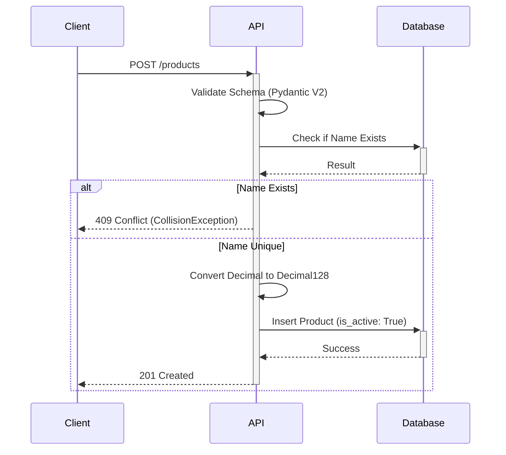

# 🛒 Store API - Modern Stack Python 2026

## 🚀 Sobre o Projeto

### Esta é uma API de gerenciamento de estoque desenvolvida com foco em **TDD (Test Driven Development)** e alta performance

### O projeto foi modernizado para as versões mais recentes do ecossistema Python, garantindo tipagem estrita e integridade de dados financeiros.

## Principais Tecnologias

* ### **Python 3.13**: Performance otimizada e novas funcionalidades da linguagem

* ### **FastAPI**: Framework moderno para construção de APIs rápidas

* ### **Pydantic V2**: Validação de dados de alta performance

* ### **MongoDB & Motor**: Persistência de dados NoSQL assíncrona

* ### **Pytest**: Suíte de testes automatizados com cobertura completa (20/20 PASSED)

* ### **Ruff**: Linting e formatação de código ultra-rápida

---

## 🏗️ Diferenciais de Engenharia

### 💰 Precisão Financeira com Decimal128

### Diferente de implementações simples que usam `float`, este projeto utiliza `Decimal128` no MongoDB e `Decimal` no Python

### Isso evita erros de arredondamento em cálculos monetários, garantindo que **0.1 + 0.2 seja exatamente 0.3**

## 🛡️ Estratégia de Soft Delete

Para manter a integridade histórica do estoque, implementamos o **Soft Delete**:

* ### **Exclusão Lógica**: Produtos "excluídos" são apenas marcados com `is_active: False`

* ### **Filtros Nativos**: Consultas e filtros ignoram automaticamente itens inativos no banco

* ### **Auditoria**: Os dados permanecem na base para verificações futuras e recuperação

## ⚡ Frontend Integrado

### O projeto acompanha um dashboard moderno (HTML5/JS) que consome a API em tempo real

* ### **Cadastro Dinâmico**: Inclusão de produtos com feedback imediato
  
* ### **Performance**: Filtros de preço processados diretamente no motor do MongoDB
  
* ### **Interatividade**: Exclusão visual com atualização em tempo real (UI/UX)

---

## 📊 Diagramas de Sequência

### Criação com Validação de Conflito (409)



## 🛠️ Como Executar

### Pré-requisitos

* ### Python 3.13+

* ### Poetry

* ### MongoDB (Local ou Docker)

## Instalação e Execução

* ### Instalar dependências

```bash
poetry install
````

* ### Rodar os testes

```bash
poetry run pytest
```

* ### Iniciar o servidor

```bash
poetry run uvicorn store.main:app --reload
```

## 🌐 Interfaces

* ### API Docs (Swagger): <http://localhost:8000/docs>

* ### Frontend: Abra o arquivo index.html no seu navegador

## 📝 Desafios Concluídos

### [x] Create: Exceções mapeadas e capturadas globalmente via CollisionException

### [x] Update: Método Patch com updated_at automático e tratamento de NotFoundException

### [x] Filtros: Range de preço (min_price e max_price) via query do MongoDB

### [x] Soft Delete: Sistema de exclusão lógica para preservação de dados
